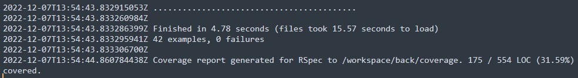

# Projeto-Integrado-III

Repositório para armazenar informações com as respectivas entregas dos trabalhos da disciplina

## Nome do Projeto:
Ramírez

## Integrantes:
- Davi dos Santos Freitas (Nasalis)
- Guthyerri Alexandrino Barbosa (Guthyerri-Alexandrino)
- Maria Alice de Souza Macedo (marialicemacedo)

## Ferramentas:
- Prototipação:
  - [Figma](https://www.figma.com/file/cOwwb2VGmEsEI1R0rnzblF/Projeto-Integrado-II-e-III?node-id=502%3A3)
  - [Trello](https://trello.com/invite/b/RaDXpwpf/c8d5c221ec8f491e8c0694f4ba1a8791/ramirez)

## Links Externos
[Back-end](https://github.com/Nasalis/ramirez)

## Cobertura de Tests - Digital Ocean

- [Relatório de Cobertura - .html](./projectAssets/coverage/index.html)